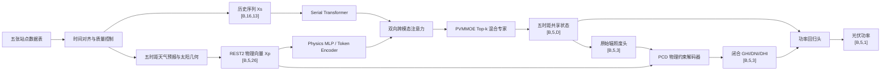

# PVMMOE–REST2–PCD 融合模型结构与工作原理

## 一、总体目标

模型同时利用历史观测中的统计规律和太阳辐射物理规律，完成 15 min、30 min、60 min、4 h、1 d 五个时距的光伏功率预测。PVMMOE 负责多模态交互和复杂天气模式建模；REST2 提供可解释的晴空辐射、太阳几何和大气状态先验；PCD 在网络末端把辐照度结果投影到严格满足物理闭合的可行域。



## 二、输入与样本构造

预测起点记为 `t₀`。历史分支读取过去 16 个 15 min 时刻，即过去 4 h；物理分支面向五个未来目标时刻分别构造一个 26 维向量。

历史序列的 13 个特征包括：两处 GHI、观测功率、观测 DNI/DHI、实测天气 GHI、温度、风速、风向正余弦、降水、PWAT 和积雪水当量。风向转成正余弦，避免 0° 与 360° 的数值跳变。

每个时距的 26 维物理向量主要包含：

- REST2 晴空 GHI、DNI、DHI；
- 目标时刻太阳天顶角、`cos(zenith)`、日外法向辐照度；
- 4300 m 海拔气压、PWAT、AOD700 和直射透过率；
- 当前及上一时刻晴空指数、智能持久性和晴空残差；
- 4 h/1 d 天气预报的 GHI 与天气衰减先验；
- 目标时距对应的晴空辐射和天气修正辐射。

PWAT 按 Folsom/REST2 约定解释为 cm。气压在没有实测站压时按 4300 m 海拔计算为 59,268.17 Pa，使 REST2 的大气光程与高海拔站点一致。

## 三、REST2 物理模态如何生成

1. 根据经纬度 100.641°E、29.919°N、时区和目标时间计算太阳天顶角、太阳高度与日外辐照度。
2. 把 `cos(zenith)`、59.27 kPa 气压、PWAT、AOD700 和日外辐照度输入 REST2。
3. 得到晴空条件下的 GHI/DNI/DHI 和直射透过率。
4. 使用当前晴空指数、降水、风速和 PWAT 构造天气衰减先验。
5. 将晴空辐射、天气预报和持久性信息组合为 26 维向量。
6. 对五个时距分别执行以上过程，形成 `[B,5,26]`，因此物理 token 与最终五个输出一一对应。

## 四、双模态编码与融合

历史序列先由 Serial Transformer 编码。它通过自注意力学习功率爬坡、云团变化、昼夜周期以及气象变量之间的时间依赖，得到历史统计表征。

REST2 物理向量由 Physics Token Encoder 投影到与历史表征相同的隐藏维度 `D`。这一步解决了原始物理向量与 PVMMOE 隐藏向量的形状不一致问题。

融合层包含两个方向：

```text
serial_from_physics：历史表征查询物理信息
physics_from_serial：物理表征查询历史变化
```

双向注意力使模型能够动态判断“当前样本更应相信观测趋势还是物理先验”。新增物理模态不会破坏原 PVMMOE 的工作方式，因为进入融合层前两种模态都已投影到相同的 `D` 维，并由明确的跨模态注意力接口交互。

## 五、PVMMOE 混合专家解码

融合后的 token 进入 PVMMOE 主干。每层包含共享专家和路由专家：共享专家学习所有天气都适用的规律；路由器为每个样本/时距选择 Top-k 专家，使不同专家分别擅长晴天、云变、降水、低太阳高度角或长时距等状态。

MoE 输出五个时距的共享隐状态 `[B,5,D]`。训练中加入专家负载均衡损失，防止路由长期集中在少数专家。

## 六、PCD 物理约束输出

MoE 首先生成未经约束的三个辐照度状态。PCD 不直接相信这三个自由输出，而是生成非负 DNI 和 DHI，再利用太阳几何重建 GHI：

```text
μ = max(cos(zenith), 0)
DNI >= 0
DHI >= 0
GHI = μ × DNI + DHI
```

因此闭合关系由网络结构保证，而不是仅靠损失函数“尽量满足”。夜间 `μ=0` 时三分量被置零，避免夜间产生无物理意义的辐照度。

功率头综合 MoE 隐状态和 PCD 修正后的物理辐照度，输出 `[B,5,1]`。训练标签中的负功率按 0 截断，符合“负值代表夜间”的业务定义。

## 七、训练目标

总损失由四部分组成：

```text
L = λp Lpower
  + λi Lirradiance
  + λm LMoE-balance
  + λr Lraw-correction
```

- `Lpower`：五时距功率主任务均方误差；
- `Lirradiance`：PCD 输出与实测 GHI/DNI/DHI 的辅助监督；
- `LMoE-balance`：专家负载均衡；
- `Lraw-correction`：限制未经约束输出偏离合理物理先验过远。

功率和辐照度损失分别按训练集尺度归一化，避免单位和量级差异导致某一项独占梯度。

## 八、数据安全与评估

任一目标时距 `h` 的预报记录必须满足：

```text
发布时间 <= 目标有效时间 - h = 预测起点 t₀
```

这保证训练时看不到预测起点之后才发布的信息。数据按时间顺序划分训练、验证和测试集，归一化参数只用训练段拟合。

评估按五个时距分别报告功率 RMSE/MAE、GHI/DNI/DHI RMSE，并检查最大物理闭合误差。这样既能比较短时与日前预测精度，也能证明 PCD 约束在全部样本上始终成立。

## 九、融合方案的关键价值

1. **准确性**：历史分支学习数据规律，REST2 为稀有天气和长时距提供稳定先验，MoE 按场景分工。
2. **物理一致性**：PCD 从结构上保证 GHI/DNI/DHI 闭合和非负，而非事后裁剪。
3. **可解释性**：可以分析跨模态注意力、专家路由、REST2 晴空先验以及 PCD 修正量。
4. **可迁移性**：工程只保留实际使用的编码器、融合、MoE、REST2 与 PCD，不依赖原三个项目的对比模型目录。
5. **多时距统一**：一个模型一次输出五个时距，共享特征学习，同时保留每个时距独立的物理 token 和评估指标。
